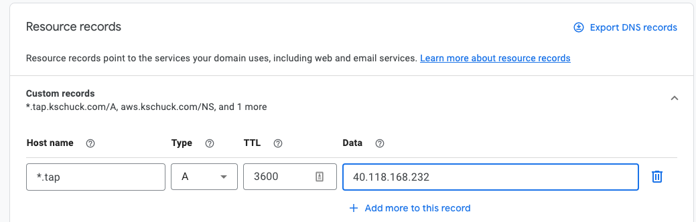

# TAP on GKE

## Pre-Requisites
  * `gcloud` cli
    * https://cloud.google.com/sdk/docs/install

## Create jumpbox (optional)
### Export GKE Project Environment
```
export GKE_PROJECT="your-gke-project"
```
### Create `gke-admin` service account
```
gcloud iam service-accounts create gke-admin \         
    --description="GKE Admin" \  
    --display-name="gke-admin"

gcloud projects add-iam-policy-binding $GKE_PROJECT \
    --member="serviceAccount:gke-admin@$GKE_PROJECT.iam.gserviceaccount.com" \
    --role="roles/container.admin"

gcloud projects add-iam-policy-binding $GKE_PROJECT \
    --member="serviceAccount:gke-admin@$GKE_PROJECT.iam.gserviceaccount.com" \
    --role="roles/cloudbuild.builds.builder"    

gcloud projects add-iam-policy-binding $GKE_PROJECT \
    --member="serviceAccount:gke-admin@$GKE_PROJECT.iam.gserviceaccount.com" \
    --role="roles/iam.serviceAccountUser"
```

### Create Jumpbox
```
gcloud compute instances create tap-jump \
--zone=us-central1-a --machine-type=n2-standard-2 \
--image-project=ubuntu-os-cloud --image-family=ubuntu-1804-lts \
--boot-disk-type=pd-standard --boot-disk-size=100GB \
--scopes="cloud-platform" \
--service-account="gke-admin@$GKE_PROJECT.iam.gserviceaccount.com"
```

## SSH to Jumpbox (optional)
If you created the jumpbox in the previous section. SSH to it before continuing:
```
gcloud compute ssh tap-jump
sudo su -
```

## Create GKE Cluster
```
gcloud container clusters create tap-cluster \
    --region=us-central1 \
    --release-channel=rapid \
    --cluster-version=1.23.5-gke.200 \
    --num-nodes=2 \
    --machine-type=n2-highcpu-4 \
    --enable-autoprovisioning \
    --min-cpu 24 \
    --min-memory 24 \
    --max-cpu 48 \
    --max-memory 48
```

## Install Tools

Export environment variables to be used in subsequent commands:
```
export PIVNET_API_TOKEN=your-api-token
export INSTALL_BUNDLE=registry.tanzu.vmware.com/tanzu-cluster-essentials/cluster-essentials-bundle@sha256:ab0a3539da241a6ea59c75c0743e9058511d7c56312ea3906178ec0f3491f51d
export INSTALL_REGISTRY_HOSTNAME=registry.tanzu.vmware.com
export INSTALL_REGISTRY_USERNAME=your-registry-username
export INSTALL_REGISTRY_PASSWORD=your-registry-password
```
Where `INSTALL_REGISTRY_USERNAME` and `INSTALL_REGISTRY_PASSWORD` are your Tanzu Network credentials.

### Install kubectl
```
curl -LO https://dl.k8s.io/release/v1.23.3/bin/linux/amd64/kubectl
mv kubectl /usr/local/bin
chmod 755 /usr/local/bin/kubectl
```

### Install pivnet cli and login
```
wget https://github.com/pivotal-cf/pivnet-cli/releases/download/v3.0.1/pivnet-linux-amd64-3.0.1
mv pivnet-linux-amd64-3.0.1 /usr/local/bin/pivnet
chmod 755 /usr/local/bin/pivnet
pivnet login --api-token $PIVNET_API_TOKEN
```

### Target GKE Cluster
```
gcloud container clusters get-credentials tap-cluster --zone=us-central1
```

### Install Cluster Essentials for VMware Tanzu
```
pivnet download-product-files --product-slug='tanzu-cluster-essentials' --release-version='1.1.0' --product-file-id=1191987
mkdir $HOME/tanzu-cluster-essentials
tar -xvf tanzu-cluster-essentials-linux-amd64-1.1.0.tgz -C $HOME/tanzu-cluster-essentials
cd $HOME/tanzu-cluster-essentials
./install.sh
```

### Install `kapp` cli
```
sudo cp $HOME/tanzu-cluster-essentials/kapp /usr/local/bin/kapp
```

### Install Tanzu cli
```
pivnet download-product-files --product-slug='tanzu-application-platform' --release-version='1.0.1' --product-file-id=1147349
mkdir $HOME/tanzu
tar -xvf tanzu-framework-linux-amd64.tar -C $HOME/tanzu
export TANZU_CLI_NO_INIT=true
sudo install $HOME/tanzu/cli/core/v0.11.1/tanzu-core-linux_amd64 /usr/local/bin/tanzu

# install plugins
tanzu plugin install --local $HOME/tanzu/cli all
tanzu plugin list
```

## Add the Tanzu Application Platform Package Repository

### Configure TAP Repository
1. Create a namespace named tap-install for deploying any component packages by running:
    ```
    kubectl create ns tap-install
    ```

1. Create a registry secret by running:
    ```
    tanzu secret registry add tap-registry \
    --username ${INSTALL_REGISTRY_USERNAME} --password ${INSTALL_REGISTRY_PASSWORD} \
    --server ${INSTALL_REGISTRY_HOSTNAME} \
    --export-to-all-namespaces --yes --namespace tap-install
    ```

1. Add Tanzu Application Platform package repository to the cluster by running:
    ```
    tanzu package repository add tanzu-tap-repository \
    --url registry.tanzu.vmware.com/tanzu-application-platform/tap-packages:1.0.1 \
    --namespace tap-install
    ```
    For example:
    ```
    $ tanzu package repository add tanzu-tap-repository \
        --url registry.tanzu.vmware.com/tanzu-application-platform/tap-packages:1.0.1 \
        --namespace tap-install
    | Adding package repository 'tanzu-tap-repository'...

    Added package repository 'tanzu-tap-repository'
    ```

1. Get the status of the Tanzu Application Platform package repository, and ensure the status updates to Reconcile succeeded by running:
    ```
    tanzu package repository get tanzu-tap-repository --namespace tap-install
    ```
    For example:
    ```
    $ tanzu package repository get tanzu-tap-repository --namespace tap-install
    | Retrieving repository tap...
    NAME:          tanzu-tap-repository
    VERSION:       4751491
    REPOSITORY:    registry.tanzu.vmware.com/tanzu-application-platform/tap-packages
    TAG:           1.0.1
    STATUS:        Reconcile succeeded
    REASON:
    ```

1. List the available packages by running:
    ```
    tanzu package available list --namespace tap-install
    ```

## Install Tanzu Application Platform

1. Clone this repository
    ```
    git clone https://github.com/kpschuck/tap-gke.git
    ```
2. Copy the `tap-full-profile-example.yml` and edit for your environment:
    ```
    cp tap-gke/tap-full-profile-example.yml tap-full-profile.yml
    ```
3. Install TAP
    ```
    tanzu package install tap -p tap.tanzu.vmware.com -v 1.0.1 --values-file tap-full-profile.yml -n tap-install
    ```

## Create DNS Record

Obtain the External IP of the envoy load balancer:
```
kubectl get service envoy -n tanzu-system-ingress
NAME    TYPE           CLUSTER-IP     EXTERNAL-IP      PORT(S)                      AGE
envoy   LoadBalancer   10.0.242.171   40.118.168.232   80:31389/TCP,443:31780/TCP   27h
```

Create a wildcard DNS record for the domain you configured in `tap-full-profile.yml`. For example:

